# Windows Server II Portfolio EP1 (Klad)

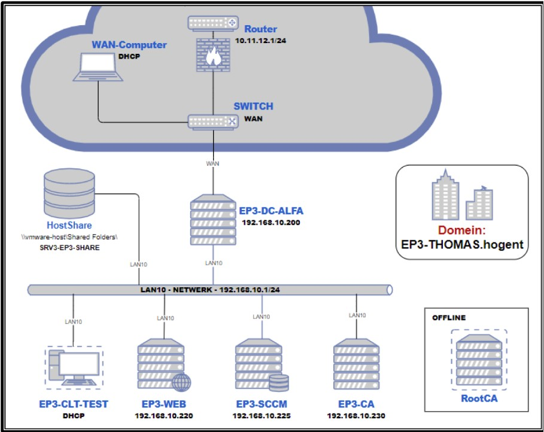

## Handleiding

### 1. Installatie Virtual Box

Vooraleer we van start kunnen gaan met het creëren van de opzet van deze opdracht moeten we Virtual Box installeren. We zullen Virtual Box gebruiken om onze omgeving en servers te virtualiseren op 1 host systeem.

1. Ga naar <https://www.virtualbox.org/wiki/Downloads> en download de recentse versie van Virtual Box voor het gepaste besturingssysteem. In ons geval Windows.

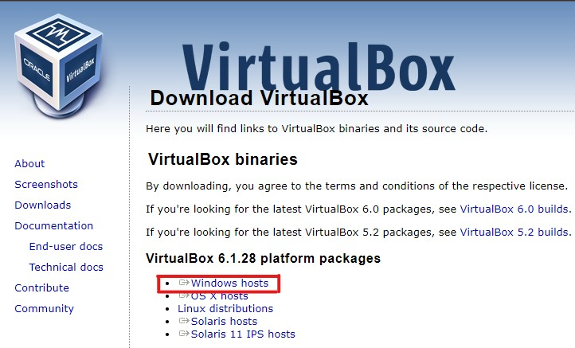

2. Open het `.exe` bestand en doorloop de installatie
   
3. Vervolgens keren we terug naar <https://www.virtualbox.org/wiki/Downloads> om het VirtualBox Extension Pack te downloaden.

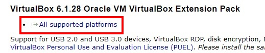

4. Open het `exe` bestand en doorloop de isntallatie

---

### 2. VM's aanmaken

Nu kunnen we beginnen met het aanmaken van de verschillende VM's die we nodig hebben om bovenstaande opstelling te bereiken.
Een klein overzicht van wat we nodig hebben:

- Domeincontroller (domain controller 1 EP1-DC-ALFA)
- Webserver (Exchange Server EP1-WEB)
- Deployment Server (EP1-SCCM)
- Certificate Server (Exchange Server EP1-CA)
- Windows Client (client EP1-CLT1 - EP1-CLT3)

Hiervoor zullen enkele ISO's voor nodig zijn. Download ze hier:

- Windows Server 2019: <https://software-download.microsoft.com/download/sg/17763.379.190312-0539.rs5_release_svc_refresh_SERVER_EVAL_x64FRE_en-us.iso>
- Windows 10: <https://www.microsoft.com/nl-nl/software-download/windows10>

#### VM Domeincontroller

De eerste VM die we zullen configureren is die van de domeincontroller. Open VirtualBox en klik bovenaan op `nieuw`.

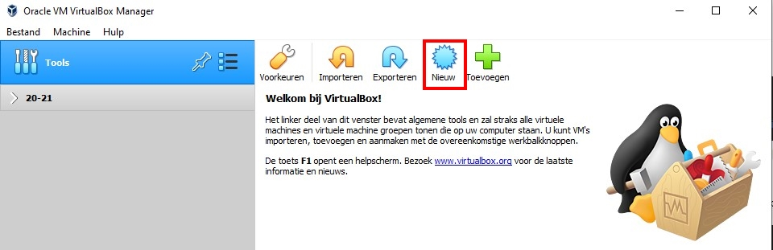

Geef de nieuwe VM de naam `EP1-DC-ALFA` en selecteer Windows 2019 als versie. Klik vervolgens op `volgende`

Kies nu hoeveel RAM u wilt toekennen aan de VM. In ons geval gebruiken we de default van 2048 MB. Klik op `volgende`

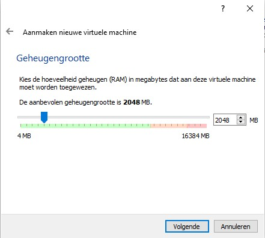

Selecteer nieuwe harde schijf aanmaken en klik op `volgende`

Kies dan voor VDI (Virtual Disk Image) en klik op `volgende`

Kies voor dynamisch gealloceerd en klik op `volgende`

Kies een locatie en ken een grootte toe. 50 GB zou voldoende moeten zijn. Klik vervolgens op `aanmaken`

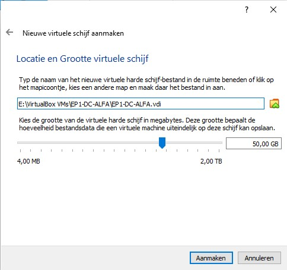

Nu gaan we de netwerkkaarten van de VM configureren. Selecteer de nieuwe VM links en klik vervolgens op `instellingen`

Klik links op netwerk en verifiëer volgende instellingen:

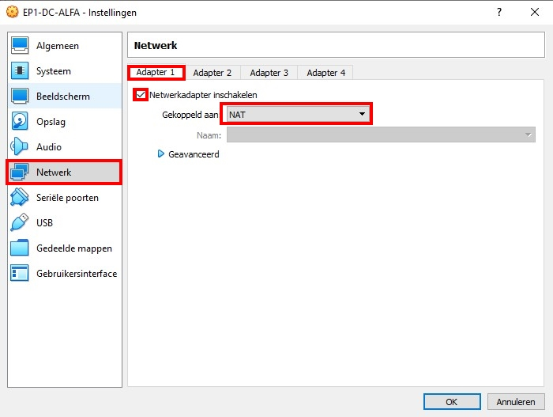

Voor adapter 2 kiezen we voor intern netwerk. We geven dit de naam LAN10

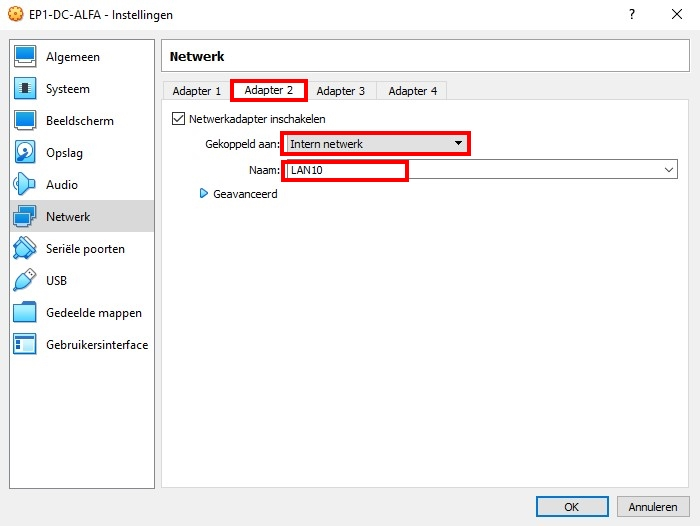

Ten slotte gaan we de Windows Server ISO klaarzetten voor installatie op onze nieuwe virtuele machine. Klik bij Opslag op Optisch station en selecteer de juiste ISO.

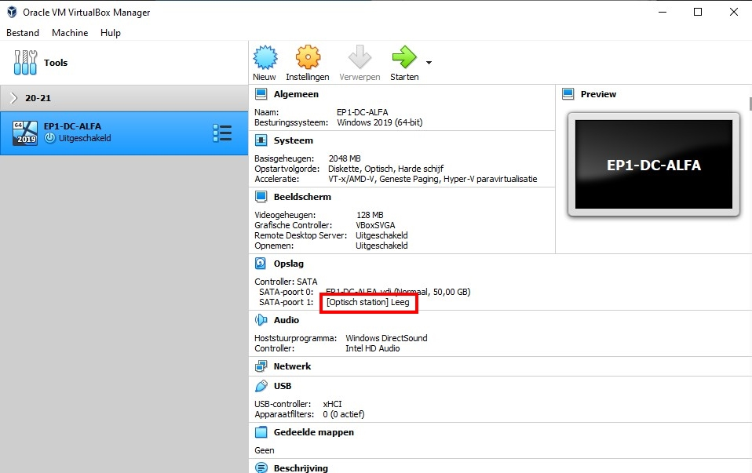

We zijn klaar met onze eerste VM voor te bereiden. We doen de resterende VM's analoog met onderstaande instellingen per VM. De instellingen die niet gespecifieerd worden blijven hetzelfde als de domeincontroller VM. Exacte configuratie van de IP adressen doen we later.

#### VM Web Server

- **Besturingssysteem:** Windows Server 2019
- **Naam:** Exchange Server EP1-WEB
- **NIC Configuratie:** 1 adapter op intern netwerk LAN10

#### VM Deployment Server

- **Besturingssysteem:** Windows Server 2019
- **Naam:** EP1-SCCM
- **NIC Configuratie:** 1 adapter op intern netwerk LAN10

#### VM Certificate Server

- **Besturingssysteem:** Windows Server 2019
- **Naam:** EP1-CA
- **NIC Configuratie:** 1 adapter op intern netwerk LAN10

#### VM's  Client 1

- **Besturingssysteem:** Windows 10
- **Naam:** EP1-CLT1
- **NIC Configuratie:** 1 adapter op intern netwerk LAN10

Je beginscherm zou er nu als volgt moeten uitzien:

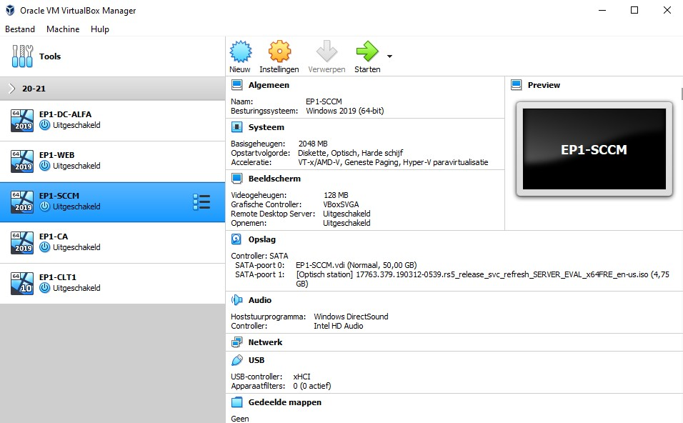

### 3. Installatie Windows Server 2019

De installatie van Windows Server verloopt analoog op elke machine.

Selecteer EP1-DC-ALFA uit de lijst en klik bovenaan op starten.

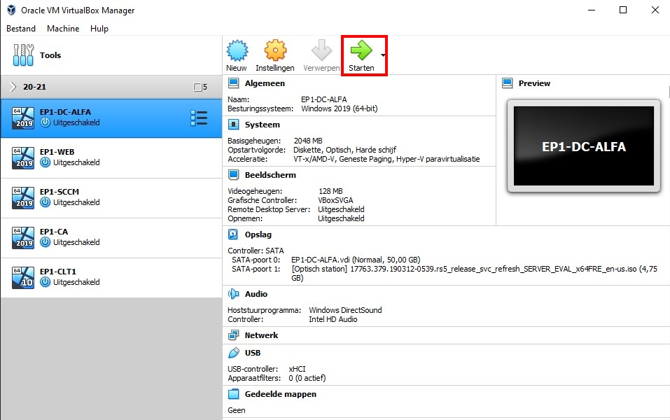

We zullen nu de stappen doorlopen om Windows Server 2019 te installeren.

1. Kies de gewenste taal, tijdformaat en type toetsenbord 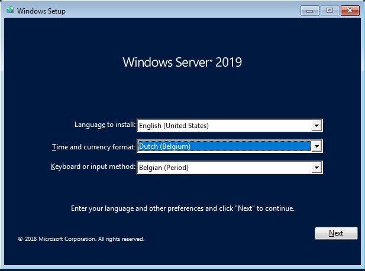 Klik vervolgens op `Next` en op `Install Now`
2. Kies voor Standard Evaluation (Desktop Experience) en klik op `Next` 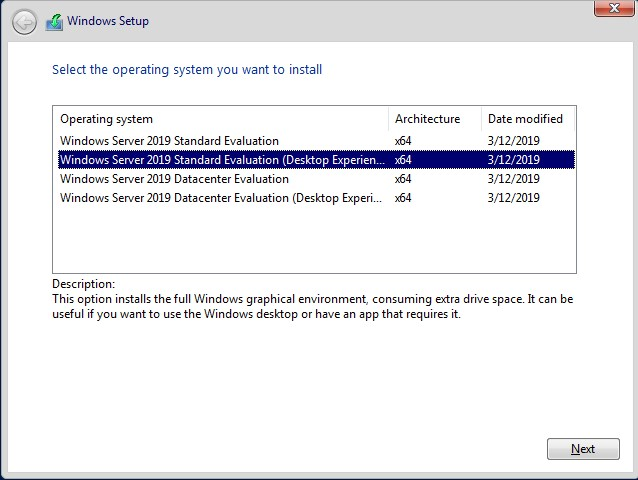 Accepteer de overeenkomst
3. Kies voor `Custom: Install Windows only (advanced)` als installatietype 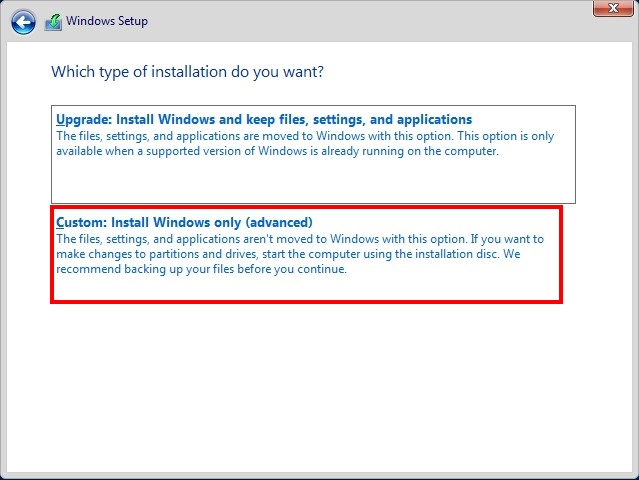
4. Klik vervolgens op `new` en `Apply` om een nieuwe partitie aan te maken op de (virtuele) harde schijf 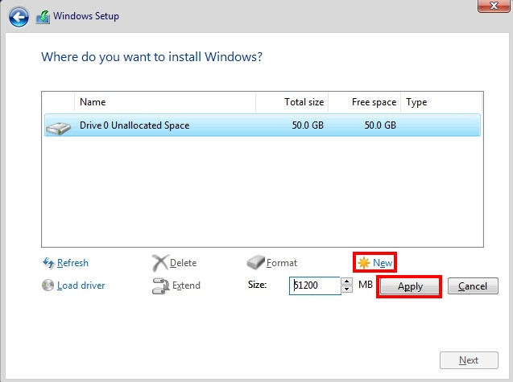 Windows kan een opmerking geven dat er een extra partitie wordt aangemaakt die gereserveerd is voor het systeem. Klik hier op `oke`.
5. Selecteer de Primary partitie en klik op `Next` 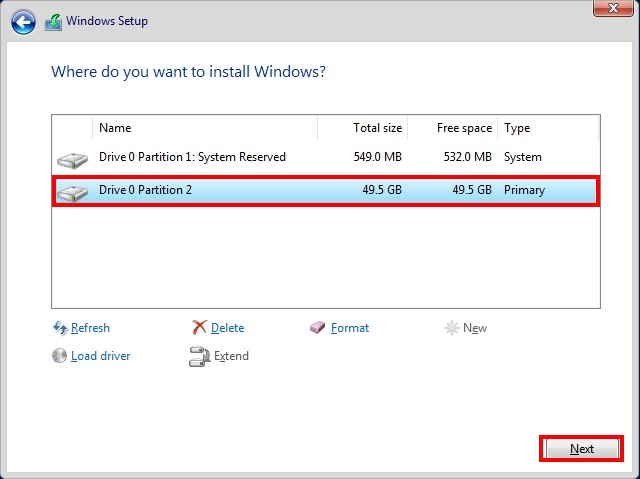

De setup begint nu met het installeren van Windows Server 2019. De machine zal een aantal keer automatisch opnieuw opstarten.

Op het volgende scherm wordt gevraagd om een wachtwoord in te geven. Ik kies hier voor `DC-root`. Klik vervolgens op `Finish` 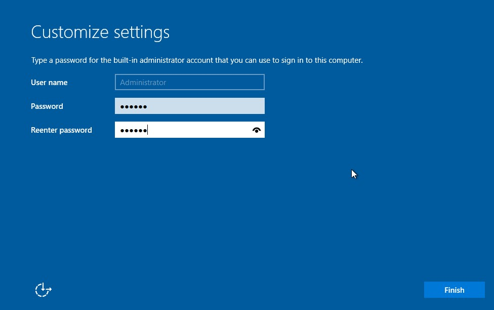

Om windows te ongrendelen klikt u bovenaan op `Invoer` > `Toetsenbord` > `Invoeren Ctrl+Alt+Del` 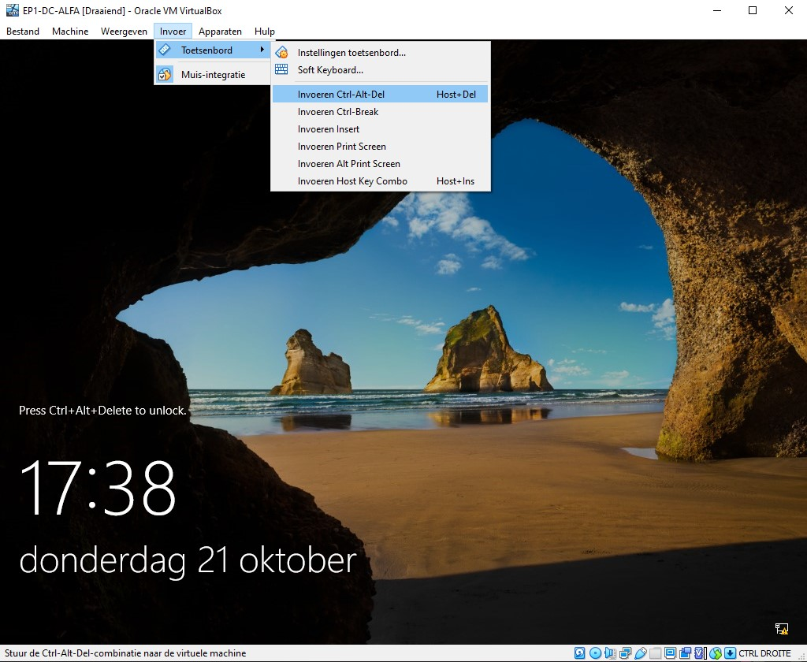

Log vervolgens in met uw gekozen wachtwoord. Server Manager zal automatisch openen.

Windows Server 2019 is nu geïnstalleerd op EP1-DC-ALFA. Herhaal deze stappen nu voor EP1-WEB, EP1-SCCM en EP1-CA.
