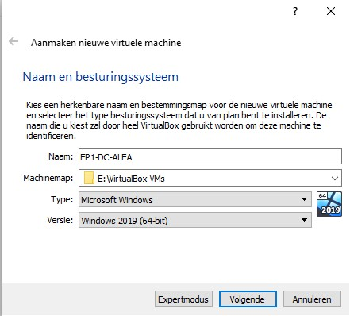

# Windows Server II Portfolio EP1 (Klad)

## Handleiding

### 1. Installatie Virtual Box

Vooraleer we van start kunnen gaan met het creëren van de opzet van deze opdracht moeten we Virtual Box installeren. We zullen Virtual Box gebruiken om onze omgeving en servers te virtualiseren op 1 host systeem.

1. Ga naar <https://www.virtualbox.org/wiki/Downloads> en download de recentse versie van Virtual Box voor het gepaste besturingssysteem. In ons geval Windows.

2. Open het `.exe` bestand en doorloop de installatie
   
3. Vervolgens keren we terug naar <https://www.virtualbox.org/wiki/Downloads> om het VirtualBox Extension Pack te downloaden.

4. Open het `exe` bestand en doorloop de isntallatie

### 2. VM's aanmaken

Nu kunnen we beginnen met het aanmaken van de verschillende VM's die we nodig hebben om bovenstaande opstelling te bereiken.
Een klein overzicht van wat we nodig hebben:

- Domeincontroller (domain controller 1 EP1-DC-ALFA)
- Webserver (Exchange Server EP1-WEB)
- Deployment Server (EP1-SCCM)
- Certificate Server (Exchange Server EP1-CA)
- Windows Client (client EP1-CLT1 - EP1-CLT3)

Hiervoor zullen enkele ISO's voor nodig zijn. Download ze hier:

- Windows Server 2019: <https://software-download.microsoft.com/download/sg/17763.379.190312-0539.rs5_release_svc_refresh_SERVER_EVAL_x64FRE_en-us.iso>
- Windows 10: <https://www.microsoft.com/nl-nl/software-download/windows10>

#### VM Domeincontroller

De eerste VM die we zullen configureren is die van de domeincontroller. Open VirtualBox en klik bovenaan op `nieuw`.

Geef de nieuwe VM de naam `EP1-DC-ALFA` en selecteer Windows 2019 als versie. Klik vervolgens op volgende

Kies nu hoeveel RAM u wilt toekennen aan de VM. In ons geval gebruiken we de default van 2048 MB. Klik op volgende.

Selecteer nieuwe harde schijf aanmaken en klik op volgende.

Kies dan voor VDI (Virtual Disk Image) en klik op volgende.

Kies voor dynamisch gealloceerd en klik op volgende.

Kies een locatie en ken een grootte toe. 50 GB zou voldoende moeten zijn. Klik vervolgens op aanmaken.

Nu gaan we de netwerkkaarten van de VM configureren. Selecteer de nieuwe VM links en klik vervolgens op instellingen.

Klik links op netwerk en verifiëer volgende instellingen:

Voor adapter 2 kiezen we voor intern netwerk. We geven dit de naam LAN10

Ten slotte gaan we de Windows Server ISO klaarzetten voor installatie op onze nieuwe virtuele machine. Klik bij Opslag op Optisch station en selecteer de juiste ISO.

We zijn klaar met onze eerste VM voor te bereiden. We doen de resterende VM's analoog met volgende instellingen per VM. De instellingen die niet gespecifieerd worden blijven hetzelfde als de domeincontroller VM.